<picture>
  <source media="(prefers-color-scheme: dark)" srcset="./assets/dark_mode.svg" />
  <source media="(prefers-color-scheme: light)" srcset="./assets/light_mode.svg" />
  
</picture>

---

### About

Backend engineer based in Ankara, Türkiye, currently at Zirve Yazılım.

I build and maintain the services behind web applications — HTTP APIs, data
models, and the integrations that tie them together — and I stay with a feature
across the whole cycle: analysis, design, implementation, testing, release.
Day to day I work in TypeScript and C#.

### Tech

### Contact

The card above rebuilds itself daily — see <a href="./SETUP.md">SETUP.md</a> for how.
